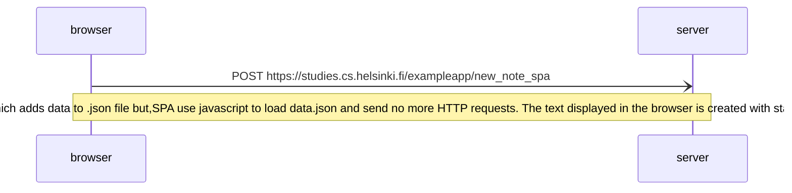

```mermaid
sequenceDiagram
    participant browser
    participant server
    browser -) server: POST https://studies.cs.helsinki.fi/exampleapp/new_note_spa
    
    Note over browser, server: This time POST request is sent to server which adds data to .json file but,SPA use javascript to load data.json and send no more HTTP requests. The text displayed in the browser is created with status code 201 and not retrieved from server.
    
```